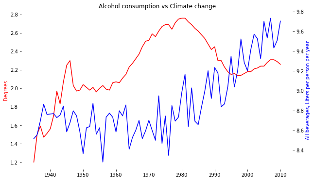

# Intro
"A study links being left-handed with more mathematical abilities", "Trump presidency is bad for US tourism". These and other similar headlines are not rare in today's news. The idea behind is that, given a set of two (and sometimes more) variables, provided that one of those change, then the other one inextrincably changes proportionally. That is, they are __correlated__. As a general term, we find variables to have a correlation coefficient that oscilates from 100% (complete, positive correlation that indicates perfect alignment) to -100% (just as perfect, but running in oposite directions). Two variables are said to not be correlated when their correlation coefficient is close to 0%.

This statistical measurement (called correlation comparison) is at the core of multiple applications of mathematics in the real world: financial modelling uses correlations to predict stock market prices, SABR metrics uses correlation on baseball players' statistics for hiring decision making, most academical economic papers establish relationships and determine government policies based on correlation analysis... the list seems to be endless.

However, that "correlation proves causation," is considered a questionable cause logical fallacy, also known as _cum hoc ergo propter hoc_ [1](https://en.wikipedia.org/wiki/Correlation_does_not_imply_causation). That means, correlation is definitely a consequence of causation, but the opposite isn't always truth. 

One of the most mediatic cases in economical academia was the paper authored by Reinhart and Rogoff, in which they _predicted_, among other things, the bankruptcy of countries that would surpass the 90% debt-to-GDP ratio, based on the statistical correlation between debt and probability of bankruptcy. As Paul Krugman very well pointed out [2](https://krugman.blogs.nytimes.com/2013/04/16/reinhart-rogoff-continued/?_r=0), the authors failed to understand this "correlation proves causation" fallacy.

Empirical proof of this fallacy can be found on Tyler Vigen's blog [3](http://www.tylervigen.com/spurious-correlations), where the authors surf the Internet searching for what is called "spurious correlations", that is, variables with a high degree of correlation that is deemed to be a byproduct of pure luck. Examples include the 95.24% correlation between people who drowned after falling out of a fishing boat in a given year, with the marriage rate in Kentucky that year.

In this assessment, we are going to make a correlation comparison between alcohol consumption in the US with the Global Temperature data of the Earth. Both are historical, well-documented data, with an incrementing drift that is expected to lead to a bit of correlation that would be, if so, spurious.

## Data cleaning
First, we need to import the data and have a glimpse of it in the form of a graph.


```python
import numpy as np
import pandas as pd
import matplotlib.pyplot as plt

alcohol_data = pd.read_csv('AlcoholUS.csv').sort_values('Year', ascending=True)
global_temperatures_data = pd.read_csv('GlobalTemperatures.csv').loc[:,'dt':'LandAverageTemperature']

print (alcohol_data.head())
print ()
print (global_temperatures_data.head())


```

         Year  Beer  Wine  Spirits  All beverages
    160  1850  0.14  0.08     1.88            2.1
    159  1851   NaN   NaN      NaN            NaN
    158  1852   NaN   NaN      NaN            NaN
    157  1853   NaN   NaN      NaN            NaN
    156  1854   NaN   NaN      NaN            NaN
    
               dt  LandAverageTemperature
    0  1750-01-01                   3.034
    1  1750-02-01                   3.083
    2  1750-03-01                   5.626
    3  1750-04-01                   8.490
    4  1750-05-01                  11.573


We obviously need to align year data in both datasets, and ensure that we take the average annual data for the Global Temperature, since the Alcohol consumption dataset doesn't include monthly data points.


```python
#Group by year
times = pd.DatetimeIndex(global_temperatures_data['dt'])
global_temperatures_grouped = global_temperatures_data.groupby([times.year]).mean()  # Average by year
print(global_temperatures_grouped.head())


```

          LandAverageTemperature
    dt                          
    1750                8.719364
    1751                7.976143
    1752                5.779833
    1753                8.388083
    1754                8.469333


What is the oldest data we have on alcohol consumption?


```python
print (alcohol_data.head(1)['Year'])
```

    160    1850
    Name: Year, dtype: int64


The answer is 1850. That means, we should ignore the first 100 years of data on Global Temperatures. To make things worse, we will need to estimate values for some rows in Alcohol Consumption, since there is data missing, and will cap values of Global Temperatures up until 2010, since Alcohol Consumption data after that is missing.


```python
# Filtering on Global Temperatures

global_temperatures_filtered = global_temperatures_grouped[185:-5] # erase the first 100 and the last 5 (1935 - 2010)
global_temperatures_filtered['Year'] = pd.Series(global_temperatures_grouped['LandAverageTemperature'].index,
                                             index=global_temperatures_grouped.index)
global_temperatures_filtered = global_temperatures_filtered.sort_values('Year', ascending=True)

print (global_temperatures_filtered.head())

```

          LandAverageTemperature  Year
    dt                                
    1935                8.515750  1935
    1936                8.554000  1936
    1937                8.698333  1937
    1938                8.863667  1938
    1939                8.760333  1939


With regards to the missing values in Alcohol data, we can try filling all values in between using ffill method within .fillna. That is, whatever value we have, it will be copied to the following NaN value, up until finding a valid entry:


```python
# Since we only have 10-year and 5-year averages, we are filling all values in between with this values.
method = 'ffill' # {‘bfill’ or ‘ffill’, but same approach: copy neighbour's value} 
# -->  ffill: propagate last valid observation forward to next valid
alcohol_data['Beer'] = alcohol_data['Beer'].fillna(method=method)
alcohol_data['Wine'] = alcohol_data['Wine'].fillna(method=method)
alcohol_data['Spirits'] = alcohol_data['Spirits'].fillna(method=method)
alcohol_data['All beverages'] = alcohol_data['All beverages'].fillna(method=method)

print (alcohol_data.head())
```

         Year  Beer  Wine  Spirits  All beverages
    160  1850  0.14  0.08     1.88            2.1
    159  1851  0.14  0.08     1.88            2.1
    158  1852  0.14  0.08     1.88            2.1
    157  1853  0.14  0.08     1.88            2.1
    156  1854  0.14  0.08     1.88            2.1


However, we can erase those years and focus on the post-Prohibition era for better, cleaner data. The obvious trade-off is information losing on this years, but we have seen that it is unreliable, and using it may corrupt the results.


```python
alcohol_data_filtered = alcohol_data[85:]
print(alcohol_data_filtered.head()) # Data has been filled.
```

        Year  Beer  Wine  Spirits  All beverages
    75  1935  0.68  0.09     0.43           1.20
    74  1936  0.79  0.12     0.59           1.50
    73  1937  0.82  0.13     0.64           1.59
    72  1938  0.75  0.13     0.59           1.47
    71  1939  0.75  0.14     0.62           1.51


That ends the data cleaning. Let's have a look at the graph.

## Data Visualization

Let's first plot the raw data so that we can see it.
For the sake of this exercise, since we are comparing this two variables, let's use a secondary axis. Doing so, we will see comparative results in terms of historical evolution of the data, creating a more colorful, richer and compressed visualization experience.


```python
# Alcohol variables
ac_x=alcohol_data_filtered['Year'].values.reshape(-1,1)
ac_y=alcohol_data_filtered['All beverages'].values
# Global temperature variables
gt_x = global_temperatures_filtered.index.values.reshape(-1,1)
gt_y = global_temperatures_filtered['LandAverageTemperature'].values


# Plot figure implies creating two subplots that are displayed on the same figure.
  
fig, ax1 = plt.subplots(figsize=(10, 6))

plt.title('Alcohol consumption vs Climate change')

# Make two y-axis to acommodate data for correlation visualization
ax2 = ax1.twinx()
ax1.plot(ac_x, ac_y, color='r')
ax2.plot(ac_x, gt_y, color='b')
ax1.set_ylabel('Degrees', color='r')
ax2.set_ylabel('All beverages, Liters per person per year', color='b')

# Viz techniques: Erase the borders (in "both" graphs)

ax1.spines["top"].set_visible(False)    
ax1.spines["bottom"].set_visible(False)    
ax1.spines["right"].set_visible(False)    
ax1.spines["left"].set_visible(False)
ax2.spines["top"].set_visible(False)    
ax2.spines["bottom"].set_visible(False)    
ax2.spines["right"].set_visible(False)    
ax2.spines["left"].set_visible(False)


plt.show()


```





## Conclusions
The comeback from the Prohibition era, combined with the fact that the trend is definitely positive both in Alcohol consumption and, scarily enough, Global temperatures, makes it reasonable to expect a positive correlation between the two variables.


```python
print (np.corrcoef(ac_y,gt_y))
```

    [[ 1.          0.09463447]
     [ 0.09463447  1.        ]]


The correlation matrix indicates that the correlation between this two variables is 9.46%, which means that these two have no meaningful statistical relationship with each other. In plain terms, it means that we should be careful when establishing a predictive model of one of this variables in terms of the other, since the relationship is quite weak, and the expected error when testing the results is likely to be high.

### Notes
This project was built on __Jupyter 4.3.0 Notebook__. Code is written in __Python 3.6.1__, making use of the __Anaconda 4.4.0__ programming environment.
